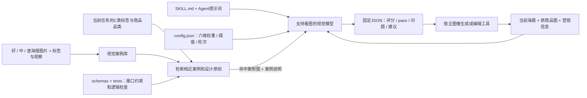

# 电商海报美学 Agent：工作流程与技术路径

> 用途：小组 Pre 讲解参考。重点说明分类依据、评分逻辑、技术实现和当前边界。内容根据当前公开版 Skill 包整理。

## 一句话介绍

美学 Agent 接收当前海报、原商品图和营销信息，先用分类标签与规则检索适用的视觉参考，再按统一的六维量表诊断海报；未达标时给出可执行的重设计方向与生成提示词，并对新图重新评价。商品和营销内容经过硬性保护检查，视觉分数高不能覆盖内容错误。

## 端到端流程

```mermaid
flowchart TD
    A[输入：当前海报 poster_image] --> C
    B[商品与任务：商品原图、卖点、价格、营销目标、C类标签] --> C
    C[校验输入与受保护内容] --> D[解析人群 / 动机 / 场景标签]
    D --> E[按标签规则匹配风格方向和参考案例]
    E --> F[视觉模型观察海报并记录可见证据]
    F --> G[六维评分与加权总分]
    G --> H{内容硬检查通过？总分≥8.5？每维≥8？}
    H -- 是 --> I[通过：输出固定 JSON 与评价说明]
    H -- 否 --> J[列出问题、修改建议、protected_content]
    J --> K[形成重设计提示词，允许大幅改构图/字体/配色/场景]
    K --> L[图像生成或编辑工具制作候选图]
    L --> C
    L -. 最多8轮；连续2轮提升不足0.2则切换设计方向 .-> K
    L -. 全程保留当前最高分候选 .-> G
```

## 分类依据：两类“分类”分别解决什么问题

### 1. C 分类标签描述营销语境

输入中的 `scene_tags` 来自小组 C 分类库，标签按三个维度组织：

| 标签维度 | 表达内容 | 对美学建议的作用 |
|---|---|---|
| 人群（audience） | 目标消费者特征 | 提示视觉语气、信息复杂度和场景熟悉度 |
| 动机（motivation） | 消费者购买动因 | 决定需要突出功能、优惠、品质或情绪价值等信息 |
| 场景（scenario） | 商品使用或营销发生的场景 | 帮助选择环境、道具、色彩氛围和构图方式 |

程序先将输入标签与分类库中的标签 ID、规范名称和正向别名做匹配，再分别解析人群、动机、场景。若标签有歧义或同一维度出现互相冲突的标签，系统会保留未确定状态并给出提示，不根据词面位置擅自猜测。

### 2. 规则与参考库把语境转换成视觉方向

标签解析后，规则采用“具体条件优先”的匹配方式：先比较明确命中的标签维度数量，再按规则优先级处理同级候选；未命中具体规则时回落到更通用的规则。输出包括风格指引、匹配原因和警告。

参考案例根据标签重合度及规则推荐进行排序，最多返回少量候选。参考库提供可迁移的设计原则，例如信息分区、主体安排和道具使用；它用于辅助构思，不要求新图复刻参考图，也不直接决定分数。

### 3. 好 / 中 / 差图片如何“喂给”美学 Agent

用户整理的 17 张好、中、差案例作为视觉参考，帮助 Agent 对照优秀设计、常见问题和可改进空间，从而给出更贴近项目审美的评分与修改建议。它们用于案例参考，不是模型参数训练，也不代表每个评分维度的标准答案；实际运行时需将命中的参考图一并传给视觉模型。

## 评分维度与通过条件

美学 Agent 使用 0–10 分制，按 0.5 分步进；总分为各维度分数乘权重后加权求和。

| 维度 | 权重 | 主要检查点 |
|---|---:|---|
| 构图与视觉平衡 | 20% | 主体大小与位置、重心、留白、道具是否遮挡或拥挤 |
| 视觉层级 | 20% | 商品、标题、卖点、价格的主次及阅读顺序 |
| 配色与对比 | 15% | 主辅色关系、商品辨识度、重要文字可读性 |
| 字体与排版 | 20% | 字级、字体、对齐、间距、分组和文字可读性 |
| 风格与场景适配 | 15% | 是否贴合商品、营销目标以及 C 分类的人群/动机/场景 |
| 自然质感与完成度 | 10% | 材质、光影、接触关系、透视、边缘和生成瑕疵 |

严格通过需要同时满足：加权总分 **≥8.5**、六个维度 **各≥8**、且商品及营销内容硬检查通过。每个分数需要对应画面证据；没有图像或看不到依据时不能编造评价。内部可记录“未评价”，固定外部接口用 `score: 0`、`confidence: 0` 表示占位且 `pass: false`。

## 评分与改图的完整迭代规则

1. **先评原图**：按六维量表逐项评分，列出可见证据、问题和受保护内容。原始商品图或必要营销信息缺失时，降低置信度；无法确认的商品/文案保护项不得声称已通过。
2. **根据低分项制定方案**：为每个未达标项给出可执行的修改建议和重设计提示词。允许大幅调整构图、字体、背景、配色、光线和道具，不要求沿用原布局；真实商品身份与用户提供的价格、卖点、Logo 等内容必须保留。
3. **生成后重新完整检查**：每张候选图都重新做内容硬检查和六维评分，不只看上轮低分项。硬检查失败或新图退步时，记录失败原因并继续优化；始终保留历史最高分候选。
4. **最多 8 轮生成与复评**：8 轮是上限，不要求凑满。达到总分≥8.5、每项≥8且硬检查通过时提前结束。用尽轮次仍未达标，就返回最高分候选并明确 `pass: false`，不能把视觉高分说成正式通过。
5. **停滞时换设计方向**：如果连续 2 轮相对历史最佳总分的提升都不足 0.2 分，停止重复微调，换一套视觉路线（例如从复杂节庆场景改为简洁棚拍、或从文字主导改为商品主导），再利用剩余轮次继续评估。停滞触发的是“换方向”，不是提前停止。

这里的“8轮”指生成候选并复评的迭代轮次，不是保证一定自动生成 8 张图。实际是否能生成取决于宿主接入的图像工具；工具不可用或报错时，Agent仍可输出评估、修改建议和提示词，但必须如实标记未完成图片生成。

## 技术路径：文件、模型和脚本各自负责什么



- **Skill 与提示词**：规定 Agent 的角色、观察方式、输出结构和不得越过的内容边界。
- **配置文件**：集中保存维度权重、通过门槛和迭代规则，调整规则时可追踪、可复用。
- **JSON Schema**：约束输入、内部评价和固定外部输出字段，方便与其他 Agent 或流程节点连接。
- **好中差视觉案例库**：保存用户偏好标签、案例观察和可用图片；好图提供正向设计锚点，中图呈现可提升空间，差图帮助识别失败模式。案例不是用于照搬版式，而是用于比较与迁移视觉原则。
- **辅助脚本**：做标签归一、规则与案例检索、分数计算/格式检查和文件输出。脚本返回案例索引及路径；宿主需要解析路径并把对应图片实际送入视觉模型，路径字符串本身不等于模型看到了图片。
- **视觉模型**：同时查看当前海报、原商品图和命中的参考图片，指出可见证据，比较好中差案例的相关差异并形成诊断。若输入里没有实际案例图片，模型只能使用可用的文字观察，不能声称做过图像对照。
- **图像生成/编辑工具**：根据修改提示词制作新候选图。当前 Skill 包通过宿主工具完成生成，不内置生成模型服务。
- **测试**：31 项逻辑测试覆盖接口、阈值、缺失输入、标签匹配和参考检索等规则；它们验证程序行为，不等同于审美质量的独立人工评测。

因此，这个仓库交付的是一套可集成的美学专家 Agent Skill 实现包，不是独立网页应用，也不是已经训练好的视觉模型。图片案例通过检索后作为视觉上下文被宿主传给模型；参数训练不在当前技术路径内。

## 输入与输出

输入包括：当前海报 `poster_image`；`product_input` 中的原商品图、卖点、价格文案、营销目标和 C 分类标签。原商品图用于校验商品身份与保护标签，当前海报用于审美评价。

对外输出采用固定 JSON：

```json
{
  "agent_name": "aesthetic_agent",
  "score": 8.2,
  "pass": false,
  "problem_list": ["主标题挤压商品主体"],
  "modify_suggestion": ["重排标题区，为商品留出完整展示空间"],
  "protected_content": ["商品主体", "Logo", "价格文案", "核心卖点"],
  "meta": {
    "judge_dimensions": ["构图与视觉平衡", "视觉层级", "字体与排版"],
    "confidence": 0.86
  }
}
```

分项依据、逐轮图片路径和生成提示词可以保存在内部任务记录里；对外结果保持约定字段，不把内部过程塞进固定接口。

## 与消费者 Agent 的衔接

截图中的双 Agent 分工可以这样讲：消费者 Agent 检查商品识别、卖点理解、优惠可见度、场景匹配与购买驱动；美学 Agent 检查视觉表达。流程规则设想为消费者侧先做信息与合规检查，通过后进入美学评价；任何重绘后都重新回到硬性检查，避免改图破坏商品、Logo、价格或卖点。

当前 GitHub 包实现并测试的是**美学 Agent**。消费者 Agent 的完整判断模块及两 Agent 的运行时编排不包含在该包内。Pre 中可把这部分称为小组总流程/集成设计，把六维审美评价和检索脚本称为当前已落地模块。

## 当前测试证据与边界

| 案例 | 原图视觉分 | 最佳视觉分 | 正式 pass | 说明 |
|---|---:|---:|---|---|
| 护肤品 618 | 5.93 | 8.58 | false | 在 8 轮预算内生成并复评 5 轮；最佳图达到视觉分门槛，但商品/包装细节无法凭原图外观确认 |
| 乌龙茶 | 7.38 | 8.63 | false | 两轮返图依次为 8.43、8.63；包装文字有重绘风险 |
| 卫浴 | 6.13 | 8.60 | false | 两轮返图依次为 8.10、8.60；商品及占位品牌信息不能正式核验 |

三例是探索性迭代，视觉分是同一模型的主观诊断，不是独立盲评。三例正式 `pass` 都为 `false`，因为缺少可校验的独立商品母本或完整商品信息，部分生成图还出现包装文字/商品细节重绘。

这些分数是同一模型对图像的主观诊断，说明迭代流程可以运行，不代表独立盲评、普遍稳定达标率或正式商业验收。公开版仓库仅放 Agent 与文字记录，不含参考图和测试图片；图片不可见时不能复核这些历史视觉分数。正式使用时须提供原海报、原商品图及准确的营销文案。

## 当前交付范围

- 美学 Agent Skill 包版本为 v2.4，含角色指令、评分量表、六维配置、输入/输出 Schema、标签及案例检索脚本、分数与报告辅助脚本和 31 项逻辑测试。
- 对外接口固定输出 `agent_name`、`score`、`pass`、`problem_list`、`modify_suggestion`、`protected_content` 和 `meta.judge_dimensions/confidence`；分项依据、提示词及逐轮过程作为内部记录。
- 公开 GitHub 仓库只上传 Agent 和文字记录，不含案例原图、测试海报图片或 PPT。小组双 Agent 流程图中的消费者检查与两 Agent 实际编排，属于小组集成层；这个仓库交付的主体是美学 Agent。
- 好中差图通过参考库检索后作为视觉上下文供视觉模型比较。公开仓库不含图片时，宿主必须提供本地可用、有权使用的参考图；单凭文字路径不能算“模型看过了图”。

## 可用于 Pre 的 55 秒讲稿

> 我们把电商海报的评价拆成消费者信息判断和视觉审美判断。美学 Agent 先读取 C 分类库中的人群、购买动机和使用场景，通过标签规则找到适用的视觉方向；同时根据新海报检索好、中、差案例，把相关参考图实际喂给视觉模型。好图让模型看到有效设计是什么样，中图展示可提升空间，差图帮助识别失败模式，模型再比较这些图和当前海报，依据构图、层级、配色、排版、场景适配、自然质感六个维度评分。这里的喂图是案例检索和视觉上下文参照，不是模型参数训练。严格通过要求总分不低于 8.5、每个维度不低于 8，并且商品、Logo、价格和卖点通过硬性保护检查。没有通过时，Agent 根据低分项提出修改方向，生成提示词，再调用图像工具制作候选图并重新检查，最多八轮，停滞时更换设计方向。工程上，Skill 和提示词负责流程，配置和 Schema 负责标准与接口，脚本负责标签及案例检索，视觉模型负责看图比较，宿主生成工具负责改图。

## Pre 页面建议

1. **流程页**：使用上面的端到端图，强调“识别语境 → 评分 → 修改 → 全面复检”。
2. **分类依据页**：解释人群/动机/场景标签如何匹配规则和参考原则；说明好中差只作定性校准。
3. **技术路径页**：用 Skill/提示词、配置/Schema、检索脚本、视觉模型、图像生成工具五层图说明分工。
4. **迭代与结果页**：展示“最多 8 轮、连续 2 轮提升不足 0.2 就换方向、保留最佳候选”的闭环，再列出测试分数和正式 `pass: false` 的原因。

## 文件依据

本说明对应 Skill 包内的 `SKILL.md`、`agent-prompt.md`、`config.json`、`schemas/`、`scripts/match-references.mjs`、`scripts/match-quality-examples.mjs`、`references/rubric.md`、`references/quality-calibration.md`、`references/integration.md` 和 `runs/` 文字报告。
